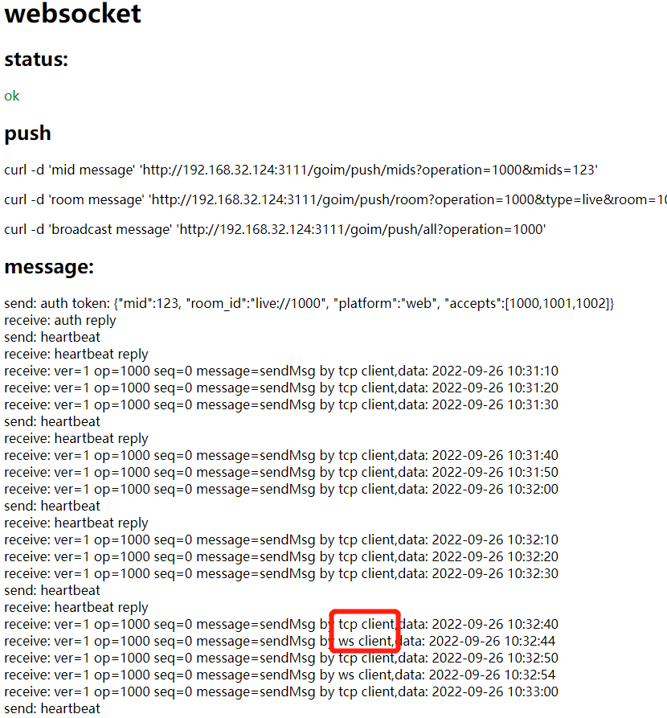

# goim-client
goim client by go

- 简单的websocket客户端连接goim服务端
- 简单的tcp客户端连接服务
- 实现了鉴权、心跳、重连、发送和接受信息的基础功能
- 必须配合该的goim服务端使用(地址: https://github.com/Hind3ight/goim)

## 效果
1. 打开tcp、websocket的go客户端，以及goim的example中js实现的客户端
2. 打开网页，可看到如下

    已接受到所在房间内tcp、websocket客户端发送的信息
   (*注：该三个客户端传递的token信息里房间为同一个，对应的改版的goim目前只做了对客户端所在房间的所有客户端进行推送，对单个用户以及所有房间客户端的推送需再次开发)
 
